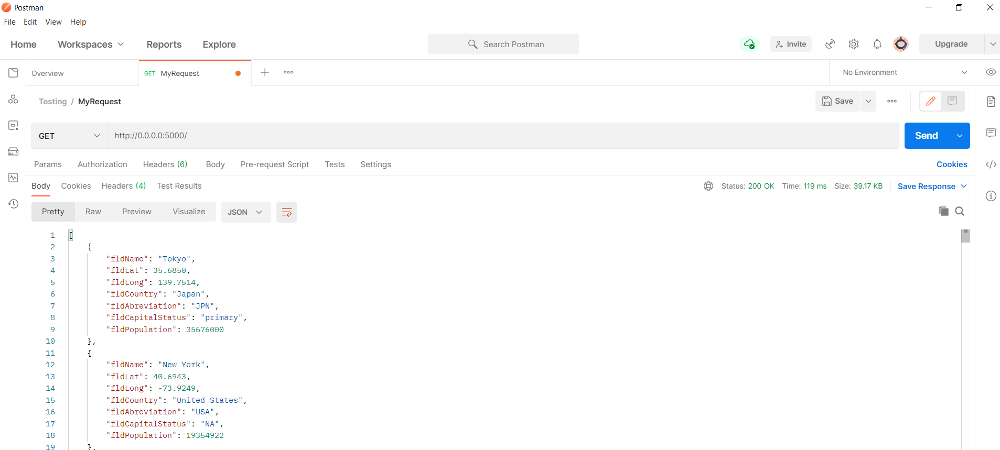
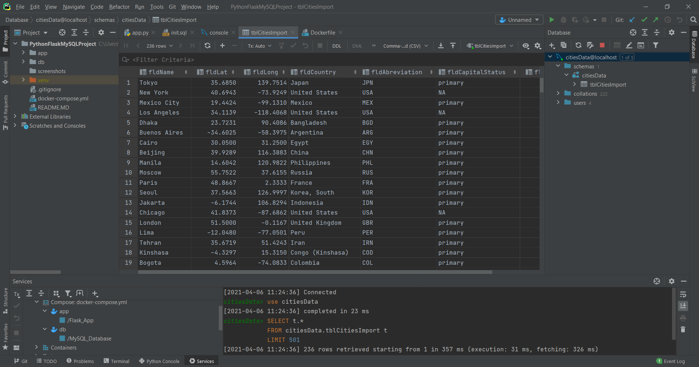

# Project Description - Final
This project is a homework assignment to teach how to get Pycharm setup with Docker, Flask, MySQL.
This project uses tools such as Docker, Flask-WTF, Bootstrap CSS, and more.
I made updates to the project as time went on like reorganizing the project structure,
adding a contact form, and routing the application to handle errors and
other tasks
# Postman Screenshot

# SQL Data Screenshot

# Before Adding New Record
.png)
# After Adding New Record
.png)
